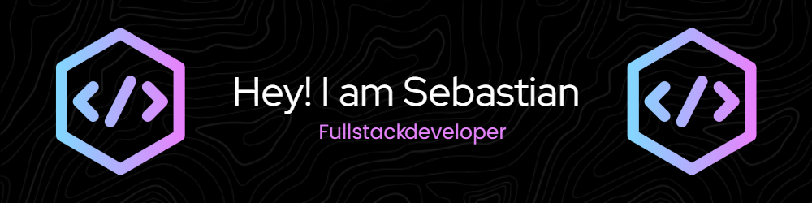

#  Welcome to my GitHub

 🌍  I'm based in Uruguay 
 ✉️  You can contact me at [sebastiancaffree.developer@gmail.com](mailto:sebastiancaffree.developer@gmail.com) 
🧠  I'm learning everyday 
 🤝  I'm open to collaborating with Developers World

### Skills

                

I am a full-stack developer specializing in Vue.js and Java, with experience in test automation using Cypress. I enjoy creating efficient and functional technological solutions, tackling both front-end and back-end tasks with a comprehensive and detail-oriented approach. I have worked on various projects that have significantly improved the quality and efficiency of web applications.

In addition to my technical experience, I have a strong drive for continuous learning. I am always looking for new opportunities to expand my knowledge and face challenges that allow me to grow professionally. I am committed to staying updated with the latest industry trends and technologies to always deliver the best in every project I participate in.

### Socials

### Badges

<b>My GitHub Stats</b>

