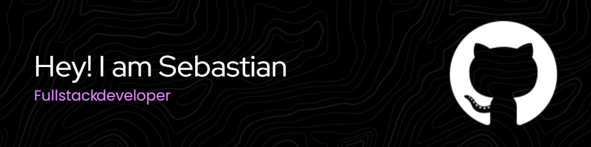

#  Welcome to my GitHub

I am a full-stack developer specializing in Vue.js and Java, with experience in test automation using Cypress. I enjoy creating efficient and functional technological solutions, tackling both front-end and back-end tasks with a comprehensive and detail-oriented approach. I have worked on various projects that have significantly improved the quality and efficiency of web applications.

In addition to my technical experience, I have a strong drive for continuous learning. I am always looking for new opportunities to expand my knowledge and face challenges that allow me to grow professionally. I am committed to staying updated with the latest industry trends and technologies to always deliver the best in every project I participate in.

* 🌍  I'm based in Uruguay
* ✉️  You can contact me at [sebastiancaffree.developer@gmail.com](mailto:sebastiancaffree.developer@gmail.com)
* 🧠  I'm learning Next.js
* 🤝  I'm open to collaborating on AI projects

### Skills

### Socials

 <a href="https://www.github.com/scaffree" target="_blank" rel="noreferrer"> <picture> <source media="(prefers-color-scheme: dark)" srcset="https://raw.githubusercontent.com/danielcranney/readme-generator/main/public/icons/socials/github-dark.svg" /> <source media="(prefers-color-scheme: light)" srcset="https://raw.githubusercontent.com/danielcranney/readme-generator/main/public/icons/socials/github.svg" />  </picture> </a> <a href="https://www.linkedin.com/in/sebastián-caffree-8971a8176/" target="_blank" rel="noreferrer"> <picture> <source media="(prefers-color-scheme: dark)" srcset="https://raw.githubusercontent.com/danielcranney/readme-generator/main/public/icons/socials/linkedin-dark.svg" /> <source media="(prefers-color-scheme: light)" srcset="https://raw.githubusercontent.com/danielcranney/readme-generator/main/public/icons/socials/linkedin.svg" />  </picture> </a>

### Badges

<b>My GitHub Stats</b>

